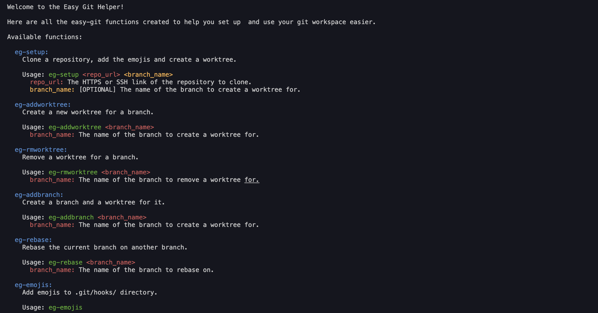

# Easy-Git

> Easy Git is a simple tool to help you set up and use your git workspaces.



## Getting Started

### Prerequisites

- [Git](https://git-scm.com/downloads)
- A terminal on zsh preferably, but check the warning below if you use bash

### Install

Get to the root directory of your terminal (command for macOS):

```sh
cd ~
```

To install Easy Git, run the following command (at the same level as your .bashrc or .zshrc file):

```sh
git clone https://github.com/MorganKryze/Easy-Git.git
```

Or click on the green "Code" button and download the zip file.

### How to use

To use Easy Git anywhere on your computer, simply add this line to your .bashrc or .zshrc file:

```sh
source ~/Easy-Git/src/easy-git.sh
```

Then, back on your terminal, run the following command:

```sh
source ~/.zshrc # or ~/.bashrc
```

> [!WARNING]
> The script are written for a zsh, if you want to use it with bash, you will have to change the script slightly:
> Comment the line 111 and uncomment the line 112. The issue comes from the fact that bash and zsh have different syntax for the read command.

You're all set up! Now, start using Easy Git by running the following command:

```sh
eg-help
```

> [!NOTE]
> The project uses [Git emojis](https://github.com/Buzut/git-emojis-hook) from [Buzut](https://github.com/Buzut). That means that you can use emojis in your commit messages. The script will automatically add the emoji to your commit message if you use the right syntax. For example, if you want to add a "feature" emoji to your commit message, you can write `:feat: Add a breaking change feature` and the script will automatically replace it with the emoji.

### Features

- [x] Setup a git workspace (clone, add emojis)
- [x] Add/ Remove worktree
- [x] Rebase after PR merge (fix the 1 commit ahead and behind) and allow to stash changes
- [x] Manually add emojis to a local repository
- [x] Add brand & worktree to a local repository

## License

This project is licensed under the MIT License - see the [LICENSE](LICENSE) file for details.
